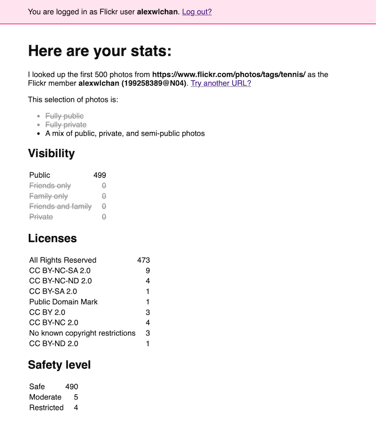

# stat-counter

This is a tiny web app that takes a Flickr URL as input, and gives you some stats about the photos you can see at that URL:

## Purpose

This was built as a supporting tool for our [Data Lifeboat project](https://www.flickr.org/programs/content-mobility/data-lifeboat/).

Flickr has a number of privacy controls that need careful consideration for Data Lifeboat, including:

* Whether a photo is public, private, or semi-public
* The license applied to the photo
* Whether the photo's owner has disabled downloads

This tool allows us to gather real examples of photos that use these controls, and see how they're used in practice.
We have a number of example Data Lifeboats we're thinking of, and it's useful to see how these privacy controls might affect them.

## Limitations

*   It can only fetch the first 500 photos from a URL
*   It only supports a limited number of URL types
